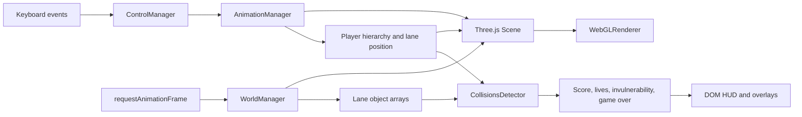

# Ninja and Lava technical documentation

This documentation describes the implementation in the current repository. The JavaScript source is authoritative; the [original project report](../report/report.pdf) is useful historical context but does not always match the final code.

## Contents

- [Architecture and game loop](architecture.md) - entry points, module responsibilities, runtime flow, scene graph, state, lifecycle, timing, and performance characteristics.
- [Gameplay systems](gameplay.md) - keyboard input, three-lane movement, spawning, collisions, stars, spike balls, hearts, lives, invulnerability, pause, and game over.
- [Rendering and animation](rendering.md) - Three.js setup, camera, lighting, bridge, lava, player hierarchy, loaders, assets, shadows, and Tween.js sequences.
- [Development and extension guide](development.md) - repository layout, local serving, manual validation, GitHub Pages constraints, known limitations, credits, and safe extension points.

## System overview

At runtime, Three.js owns the scene graph, camera, renderer, asset loaders, clock, lights, materials, and bounding boxes. Tween.js mutates transforms over time for the ninja and spike balls. `main.js` coordinates both systems and mirrors score, lives, pause, and game-over state into ordinary DOM elements.

## Historical material

- [Original player hierarchy diagram](../hierarchical-model-graph/project%20graph%20final.png)
- [Original bridge hierarchy diagram](../hierarchical-model-graph/bridge.png)

These diagrams preserve the project's design material. Where a label or parent relationship differs, use the source-derived scene graph in [architecture.md](architecture.md#scene-graph) as the current reference.
