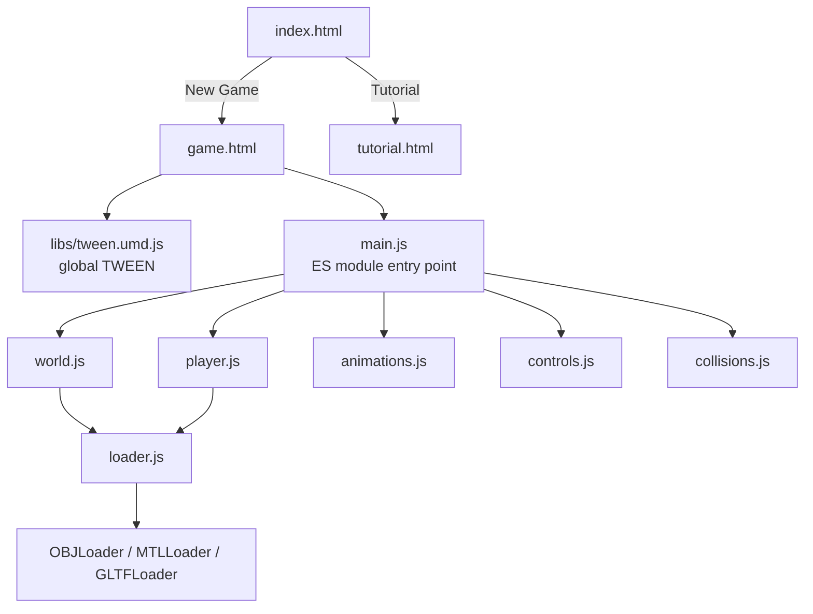
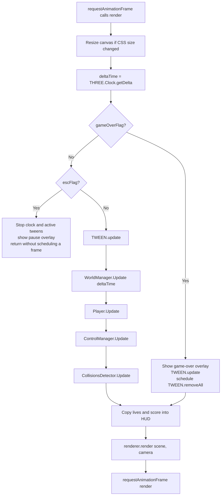
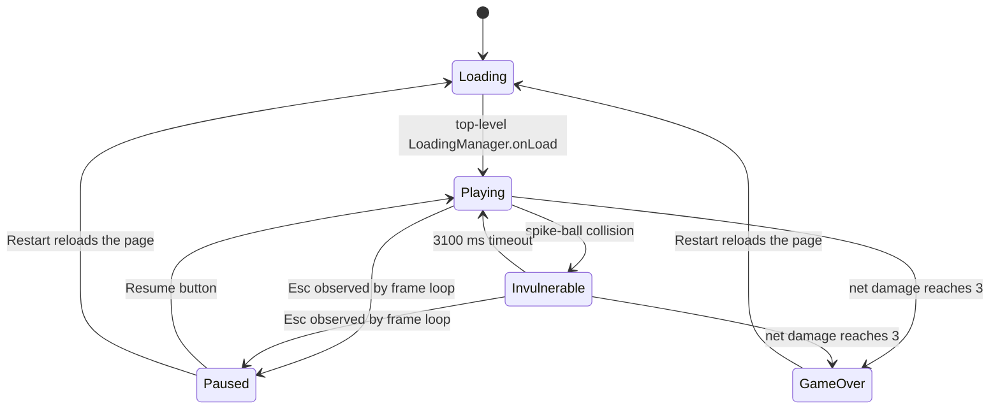

# Architecture and game loop

## Runtime model

Ninja and Lava is a static browser application. `index.html` is the menu, `tutorial.html` is a separate instructions page, and `game.html` is the game shell. The game page loads Tween.js as a classic UMD script, which creates the global `TWEEN` object, and then loads `main.js` as an ES module.

There is no package manifest, package manager, bundler, compilation step, backend, or runtime API. Three.js and its add-ons are checked into `libs/`; Normalize.css is the only runtime dependency requested from a CDN.



`stats.module.js` and `dat.gui.module.js` are imported by `main.js`, but the imported values are not used. `lavaGround` and `Rock` exist in the loader layer, but their call sites in `world.js` are disabled.

## Responsibilities

| Module | Responsibility |
| --- | --- |
| `main.js` | Initializes the DOM actions, Three.js scene, camera, renderer, loading manager, subsystem instances, HUD, pause flow, and frame loop. |
| `world.js` | Builds lights, lava, bridge, and cave decoration; owns the three lane arrays; spawns and advances stars, hearts, spike balls, and empty spawn containers. |
| `player.js` | Constructs the articulated ninja hierarchy, loads its OBJ head, owns the player `Box3`, and manages the directional light. |
| `animations.js` | Creates and chains Tween.js animations for running, torso sway, jumping, lane dashes, and the game-over fall. |
| `controls.js` | Converts keyboard state into calls to `AnimationManager`. |
| `collisions.js` | Updates object and player `Box3` bounds, applies pickup and damage rules, and owns score, effective lives, invulnerability, and game-over state. |
| `loader.js` | Wraps OBJ/MTL and glTF loading for the head, gameplay objects, rocks, and stalagmites. |

The subsystem references form a small dependency graph rather than an event bus: `main.js` constructs every manager, passes `Player` and `WorldManager` into `CollisionsDetector`, and passes `Player` and `AnimationManager` into `ControlManager`.

## Initialization sequence

`init()` performs these operations synchronously:

1. Attach handlers to the pause, game-over, camera, and navigation buttons or keys.
2. Create the `Scene`, `PerspectiveCamera`, `WebGLRenderer`, and disabled `OrbitControls`.
3. Create a stopped `THREE.Clock`.
4. Create one top-level `THREE.LoadingManager`.
5. Construct `WorldManager`, then `Player`, `AnimationManager`, `CollisionsDetector`, and `ControlManager`.
6. Create the score and hearts elements in memory.

Constructing the world immediately starts loading the environment textures and 50 glTF stalagmite instances. Constructing the player starts the OBJ/MTL head load. These use the top-level loading manager. Its `onLoad` callback removes the loading overlay, appends the renderer canvas and HUD to the document, requests the first frame, and starts the clock.

Objects spawned after play begins use private loading managers inside `SpikeBall`, `Star`, and `Heart`. They therefore do not delay or restore the initial loading overlay.

## Scene graph

The effective scene graph produced by the code is:

```text
THREE.Scene
├── AmbientLight
├── SpotLight
├── HemisphereLight
├── RectAreaLight (below the lava)
├── RectAreaLight (far end of bridge)
│   └── RectAreaLightHelper
├── Lava Mesh
├── Bridge Mesh
│   ├── 10 alternating arch Meshes
│   ├── left rail Mesh
│   └── right rail Mesh
├── Stalagmite container
│   └── 50 extracted glTF stalagmite_2 objects
├── Player character Object3D
│   └── waist and articulated body hierarchy
├── DirectionalLight owned by Player
└── Spawned Object3D containers (direct scene children)
    └── spike-ball, star, or heart OBJ hierarchy when loaded
```

Gameplay objects are direct children of the root scene. Although `SpawnObj()` passes the bridge as a constructor parameter, `WorldObject` does not retain that parameter; the wrapper is later added with `scene.add(obj.mesh)`.

The camera and renderer are not scene children. The HUD, loading screen, pause menu, and game-over menu are DOM elements layered separately from WebGL.

See [Rendering and animation](rendering.md) for geometry, material, light, camera, and transform details.

## Frame loop

The loop is the `render(timeElapsed)` function in `main.js`. The browser-provided `timeElapsed` argument is normalized but not used for gameplay. The actual order is:



The order has several consequences:

- World objects move before collision bounds are tested.
- Input state is translated into new tweens after `TWEEN.update()` for that frame, so a newly started movement advances on a later Tween.js update.
- The HUD is synchronized once per rendered frame from `CollisionsDetector` getters.
- Game over is detected at the beginning of a collision update from the already recorded net damage. The fall tween is started there, and the main loop enters its game-over branch on the following frame.
- During game over the scene continues to render and Tween.js continues to update, but world movement, input processing, player light updates, and collision checks stop.

## Time and refresh-rate behavior

Forward object motion is time-based. `THREE.Clock.getDelta()` returns seconds since the previous active frame, and each lane advances objects by:

```text
new z = old z + deltaTime * 13
```

This keeps forward speed approximately stable across refresh rates. The three lane speeds remain fixed at 13; the code contains no difficulty ramp.

Tween.js uses its own current-time source because `TWEEN.update()` is called without an explicit timestamp. Player movements and model animation durations are therefore time-based as well.

Spawn attempts are different: each lane performs a `Math.random() > 0.80` gate once per frame. Minimum distance still prevents objects from becoming arbitrarily close, but the number of opportunities to pass the random gate depends on frame rate. See [Spawning](gameplay.md#spawning).

## Logical state

There is no enum or centralized state machine. Runtime state is represented by booleans, counters, current transforms, and whether the animation loop is scheduled.



- **Loading:** the CSS loader is visible and no frame is scheduled.
- **Playing:** `gameOverFlag`, `invulnerableFlag`, and `escFlag` are false.
- **Invulnerable:** gameplay continues, including input, world motion, and rendering, but the complete collision-processing block is skipped.
- **Paused:** the clock and every active tween are stopped. The loop returns without requesting another frame; the Resume button restarts the saved tweens and requests a new frame.
- **Game over:** the overlay is shown and the fall animation continues while other gameplay subsystems are frozen.
- **Restarting:** there is no in-memory reset path; both restart buttons call `window.location.reload()`.

Score and heart counters are module-level variables in `collisions.js`, while booleans and the detected-object map are detector-instance fields. A page reload resets all of them.

## Object lifecycle

The implemented lifecycle differs from a conventional allocate-update-remove loop:

```text
frame-based spawn attempt
→ create WorldObject container at z = -100
→ choose/load an OBJ type (or leave the container empty)
→ add container to a lane array and the scene
→ move toward positive z using delta time
→ update Box3 and test collision while interactions are enabled
→ hide a collected star/heart, or record a spike-ball hit
→ set the entire container invisible after z > 4
→ continue retaining, moving, and scanning the object indefinitely
```

The object ID is recorded in `CollisionsDetector.detected` after a pickup or hit so the same wrapper cannot apply its effect twice. Stars and hearts are also hidden immediately. Spike balls remain visible until they pass `z = 4`.

No code removes passed objects from the scene or lane arrays, disposes geometries or materials, or returns objects to a pool. `WorldManager.unused` and local `visible`/`invisible` arrays exist but are not populated into a reuse mechanism.

## Performance characteristics

The project does not contain benchmarks. Its runtime structure nevertheless exposes the following costs:

- The initial scene requests the same glTF scene 50 times and extracts one named node from each result. Browser caching can reduce repeated transfer, but each load still creates/parses scene content before extraction.
- Bridge construction issues many separate texture-loader calls for repeated bridge and normal-map files.
- Each spawn constructs a new wrapper and starts a fresh OBJ/MTL load with its own manager. Loaded meshes and their materials are not shared between objects.
- Every passed wrapper remains in its lane array. It continues moving, receiving a `Box3` update, and participating in the linear collision scan even after it becomes invisible.
- Every spike ball owns an infinite rotation tween; hiding the wrapper does not explicitly stop that tween.
- Shadows are globally enabled and several large meshes both cast and receive shadows.
- Each hit starts a repeating color-reset interval, and each game-over frame starts another interval that calls `TWEEN.removeAll()`. These timers are not cleared.

These choices are acceptable for a short demonstration run, but memory use, collision work, active tweens, and timer count can grow over time. Object pooling or explicit removal would be the first architectural improvement for longer sessions.
