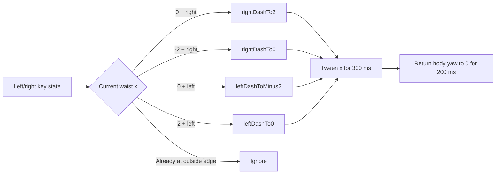
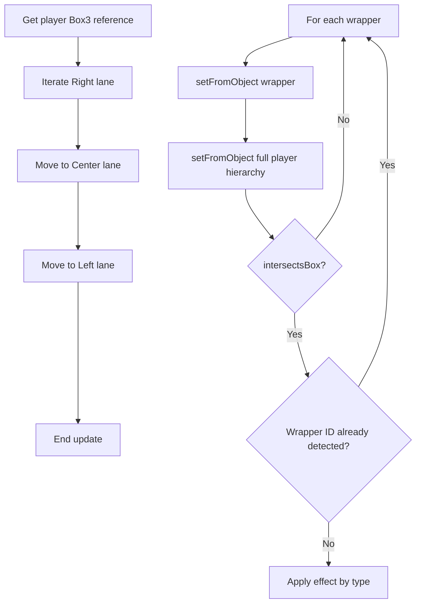

# Gameplay systems

## Player controller and lanes

The ninja does not translate forward during normal play. Its waist remains near `z = 0`, while the world objects move from `z = -100` toward positive `z`. A looping limb animation supplies the visual running motion.

The three lanes are hard-coded world-space x coordinates:

| Logical lane | `WorldManager.objects` index | Player/object x coordinate |
| --- | ---: | ---: |
| Right | `0` | `2` |
| Left | `1` | `-2` |
| Center | `2` | `0` |

The player starts in the center lane because `waist.position.x` begins at `0`. There is no separate `currentLane` field: the exact x component of the animated waist transform is the lane state used by `ControlManager`.

### Lane-change flow



The outer-lane cases have no transition farther outward, so the character cannot intentionally leave the three lanes. While a dash is between endpoints, x is not exactly `-2`, `0`, or `2`, so additional dash calls do nothing. A held direction can trigger the next valid dash as soon as the previous tween reaches an exact endpoint; it is not necessary to release and press again.

Lane changes are disabled while `jumpingFlag` is true. If both lateral inputs are held, the right-input branch wins because it is evaluated first.

## Input

`ControlManager.InitInput()` registers document-level `keydown` and `keyup` listeners and stores three booleans. `ControlManager.Update()` reads them once per active frame.

| Key | Stored action | Runtime effect |
| --- | --- | --- |
| Space (`keyCode 32`) | `spacebar` | Stop the run tween and start the jump when not already jumping. |
| Right Arrow or `D` (`39` / `68`) | `arrowR_d` | Request a one-lane right dash when grounded. |
| Left Arrow or `A` (`37` / `65`) | `arrowL_a` | Request a one-lane left dash when grounded. |

The old-key snapshot initialized by `ControlManager` is not used, so controls are level-triggered rather than press-edge-triggered. Holding Space can start another jump after the previous jump clears its flag.

`main.js` installs a separate `keydown` listener for:

- `Esc`: set the pause flag. This does not toggle pause; resuming requires the overlay's Resume button.
- `1`, `2`, `3`: apply one of three camera position/rotation presets.
- `4`: toggle the enabled state of `OrbitControls`.

The listeners remain registered while loading, paused, or game over. Gameplay input state is not applied while its manager is not being updated. No handler calls `preventDefault()`.

Mouse or pointer gestures only operate the optional orbit camera. There are no touch, click, or swipe controls for lane movement or jumping.

## Jump

Space triggers a roughly 950 ms chain of Tween.js keyframes. The waist reaches a local y target of `3.5` before returning to `0`; the articulated limbs are posed during takeoff and landing. Because collision bounds are rebuilt from the entire player hierarchy, this vertical motion is also the game's obstacle-avoidance mechanic rather than a cosmetic animation only.

While jumping:

- the run and torso-sway tweens are stopped;
- lateral input is ignored;
- collision detection continues against the updated player `Box3`;
- running restarts on a later control update after `jumpingFlag` becomes false.

See [Tween animations](rendering.md#tween-animations) for the keyframe timings and easing functions.

## Endless-runner system

The bridge, lava, camera, and normal player root stay fixed. Only spawned gameplay wrappers move:

```text
spawn at z = -100
→ advance by deltaTime × 13 each frame
→ pass the player near z = 0
→ become invisible after z > 4
```

This opposing motion, combined with the looping run animation, creates the endless-runner illusion. The bridge is a single 106-unit mesh and is neither translated nor recycled. The lava is a static plane; none of its textures scroll.

All three lanes use the same constant speed of 13 world units per second. Speed, probabilities, and separation ranges do not change with score or elapsed time, so the project has no difficulty progression.

## Spawning

`WorldManager.Update()` calls `ShouldISpawn()` once for each lane, in center-left-right order. Each call first requires `Math.random() > 0.80`. When that frame gate passes:

1. A new required separation is sampled uniformly from 10 to 20 world units.
2. An empty lane spawns immediately.
3. A populated lane measures `abs(lastObject.z + 100)`, which is the distance traveled by the most recently created wrapper from its `z = -100` spawn point.
4. The lane spawns only if that distance exceeds the sampled separation.

There is no timer, fixed frame counter, total-object cap, or cross-lane coordination. The distance rule is the only cooldown; the per-frame random gate adds a small variable delay after it is satisfied.

`SpawnObj()` creates a `WorldObject` at `z = -100`, assigns the lane x coordinate, stores it in the matching lane array, and adds its wrapper directly to the scene. The wrapper makes a second random choice:

| Random interval | Result | Nominal share of spawn events |
| --- | --- | ---: |
| `value <= 0.55` | Spike ball | 55% |
| `0.55 < value <= 0.85` | Star | 30% |
| `0.85 < value < 0.97` | No type or child mesh | 12% |
| `value >= 0.97` | Heart | 3% |

The empty interval is real: the wrapper is still stored, moved, hidden, and used as the lane's most recent spawn, but its `Box3` remains empty and it cannot interact.

## Collision detection

The project does not use a physics engine, raycaster, lane-distance shortcut, or bounding spheres. `CollisionsDetector.Update()` uses axis-aligned `THREE.Box3` bounds.



The lane loops are written out separately rather than sharing one helper. For each object, the wrapper collider and full-character collider are recomputed from their current scene transforms. The wrapper's Three.js mesh ID is used as the deduplication key.

A spike hit records the ID and returns immediately from the entire collision update. A star or heart pickup records and hides the wrapper, then allows iteration to continue. This makes it possible to process more than one overlapping collectible in a frame, while only the first newly detected spike hit is processed.

When invulnerability is active, all three collision loops are skipped. The world continues to move objects, but neither their colliders nor the player's collider are refreshed until interaction resumes.

## Stars and score

Stars are OBJ/MTL models loaded into a wrapper, scaled to `0.25`, and rotated 90 degrees around x. Their intended rotation tween is commented out, so they do not animate independently.

On first intersection:

```text
star Box3 intersects player Box3
→ wrapper.visible = false
→ wrapper ID recorded as STAR
→ module-level score incremented by 1
→ HUD reads getScore() later in the frame
```

Score starts at zero. There is no multiplier, passive score, high score, storage, server synchronization, or persistence. Reloading the page resets it.

## Spike balls and damage

Spike balls are OBJ/MTL models scaled to `(0.7, 0.6, 0.7)`. Their loaded material is recolored dark gray and given reflectivity and specular values. An infinite 500 ms linear tween continually modifies the OBJ rotation around x; the wrapper `Box3` therefore follows the rotated model.

On first intersection:

```text
spike Box3 intersects player Box3
→ record wrapper ID as SPIKEBALL
→ enable invulnerability
→ consume a stored extra heart, or move waist z forward by 1
→ start hit blink unless fewer than one life will remain
→ schedule invulnerability end after 3100 ms
→ stop the current collision update
```

The spike wrapper is not hidden by the collision itself. Deduplication prevents the same spike from damaging the player again; the world hides it after it passes `z = 4`.

## Hearts and effective lives

The life system is derived from collision history instead of a single `lives` variable:

- `detected` stores every unique collision by mesh ID and type.
- `detectedLength` is recalculated each update as the number of recorded spike collisions minus `totalHearts`.
- `getHearts()` returns `3 - detectedLength`.
- `totalHearts` increments for every collected heart.
- `actualHearts` tracks hearts collected while the waist has not been pushed forward by prior damage.

If `waist.position.z > 0`, collecting a heart moves the waist back by one and increments `totalHearts`. Otherwise the pickup increments both `actualHearts` and `totalHearts`. A later spike consumes `actualHearts` before it pushes the waist forward.

This implementation starts the displayed life count at three but has no maximum. Collecting hearts at full health can make the HUD show four or more, and those extra hearts absorb later hits. The minimum relevant value is zero because game over begins once net recorded damage reaches three.

Hearts are red OBJ/MTL models scaled to `0.01`. Like stars, their independent rotation tween is commented out. A pickup hides the wrapper and records its ID before applying the life changes.

## Invulnerability and hit feedback

`invulnerableFlag` becomes true on a spike collision and is cleared by a 3100 ms `setTimeout`. The main frame loop continues normally, but `CollisionsDetector.Update()` skips its entire interaction block. Concretely, the ninja cannot:

- be hit by another spike ball;
- collect a star;
- collect a heart.

Input, lane changes, jumping, animation, world movement, HUD updates, and rendering continue.

`blink()` indicates the state by changing every player mesh material's emissive color between red and black. It uses three groups of JavaScript timeouts: one long red phase, then successively faster flashes through roughly three seconds. It is independent of Tween.js. The final black reset is implemented as a repeating interval rather than a one-shot timeout.

## Game over

At the start of each collision update, the detector recalculates net damage. When `detectedLength >= 3`, it sets `gameOverFlag` and starts `AnimationManager.fallAnimation()`.

On the next frame, `main.js` stops calling the world, player, controls, and collision managers. It shows the game-over overlay, keeps advancing Tween.js so the fall can finish, updates the HUD, renders, and requests another frame. The fall first moves the waist to `z = 4`, poses the limbs, then lowers it to local `y = -5` after a 500 ms delay.

The game-over Restart button reloads the page; Menu navigates to `index.html`. Reloading is the cleanup mechanism: it recreates the scene, resets score and life counters, resets player transforms and flags, discards all spawned objects, and restarts asset loading. There is no partial in-memory reset routine.

## Pause and resume

When an active frame observes `escFlag`:

1. Stop the Three.js clock.
2. Copy `TWEEN.getAll()` into a temporary array and call `stop()` on every tween.
3. Show the pause overlay.
4. Return without rendering or scheduling another frame.

Resume hides the overlay, clears `escFlag`, restarts the clock, calls `start()` on each saved tween, and requests a new frame. Restart reloads the page; Menu returns to `index.html`.

Because stopped tweens are restarted rather than resumed from a preserved internal timestamp, pause/resume starts new tween timing from their current object values. Camera keys remain handled by their separate document listener while the gameplay loop is paused.
